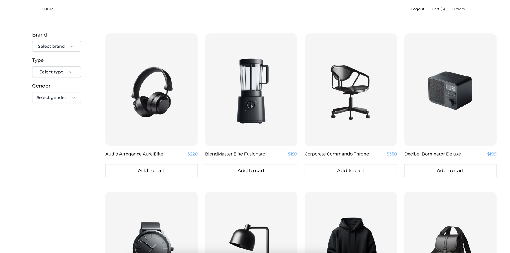
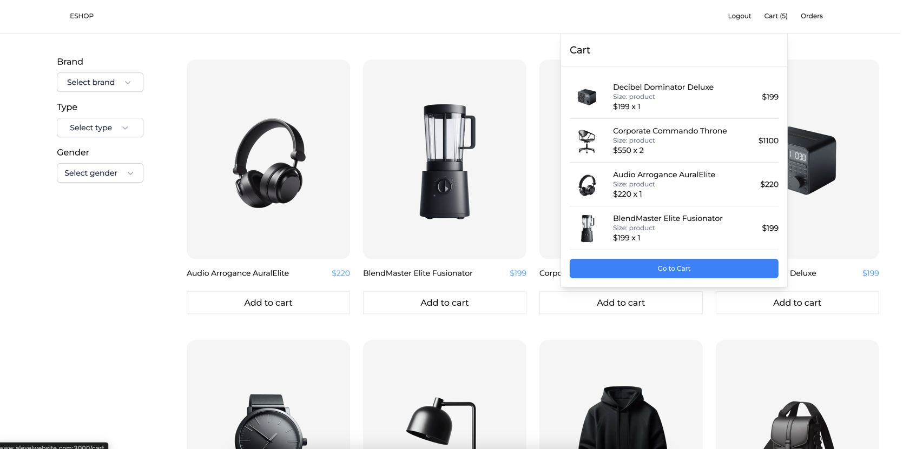
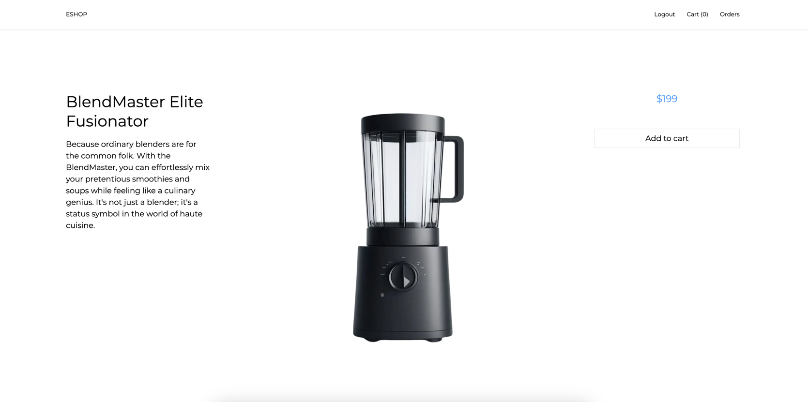
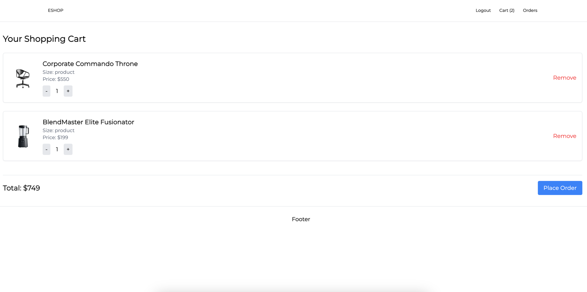
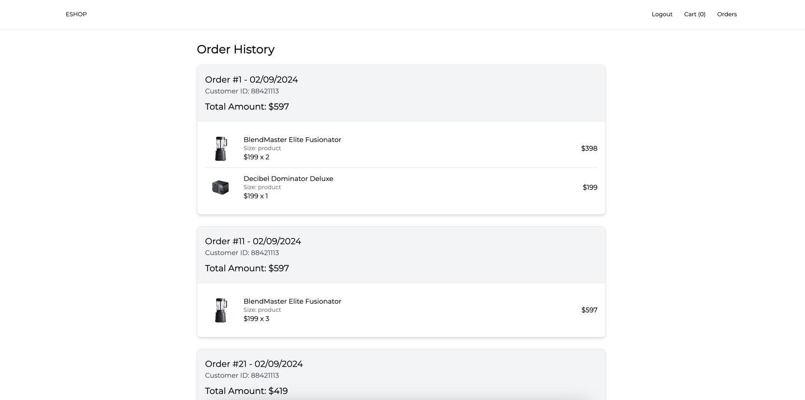

# eShop Frontend Application

This is a simple frontend application built using Next.js.

## Getting Started

To run this application locally, follow these steps:

1. **Install dependencies:**

   ```bash
   npm install
   ```

2. **Start the development server:**

   ```bash
   npm run dev
   ```

   This will start the application on `http://localhost:3000`.

3. **Build the application for production:**

   ```bash
   npm run build
   ```

4. **Start the production server:**

   ```bash
   npm run start
   ```

## Environment Variables

- Create a `.env` file in the root directory.
- Add necessary environment variables, such as API URLs and authentication secrets.

## Scripts

- `npm run dev`: Starts the development server.
- `npm run build`: Builds the application for production.
- `npm run start`: Starts the production server.

## Technologies Used

- **Next.js**: React framework for server-side rendering and static site generation.
- **React**: JavaScript library for building user interfaces.
- **Next-Auth**: Authentication for Next.js applications.
- **PostgreSQL**: Database connection using the `pg` library.
- **Sass**: CSS preprocessor for writing styles.
- **Tailwind CSS**: Utility-first CSS framework for styling.

## Images




